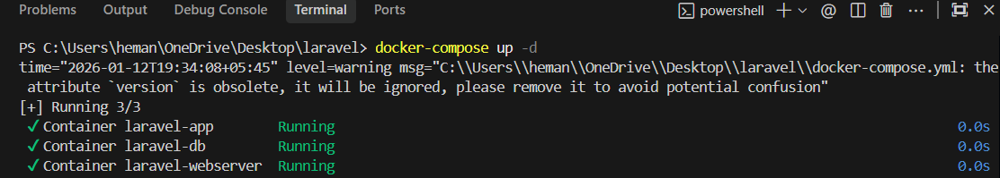
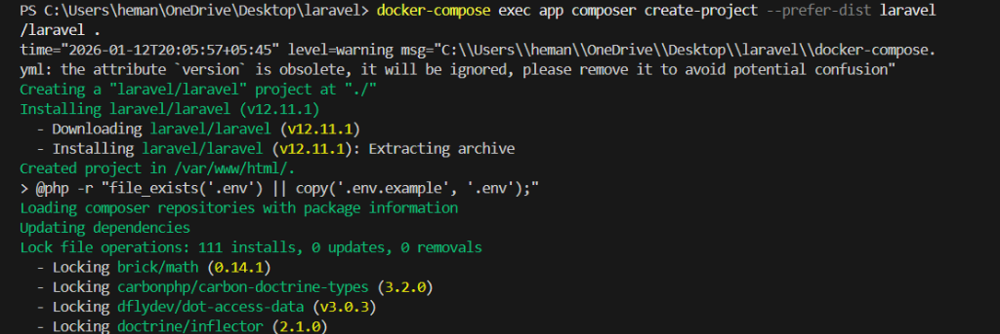
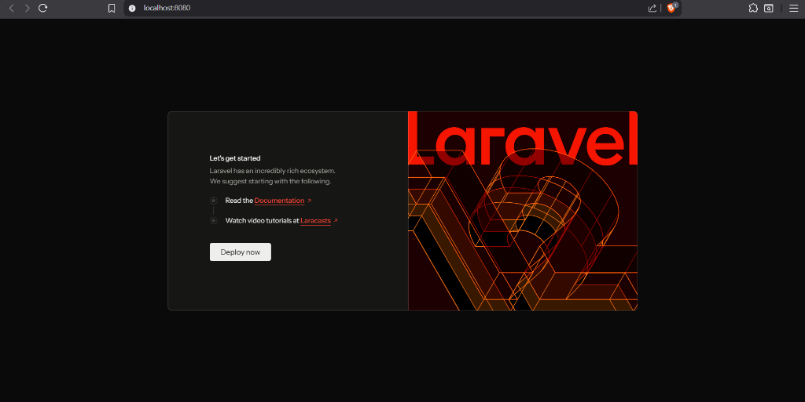
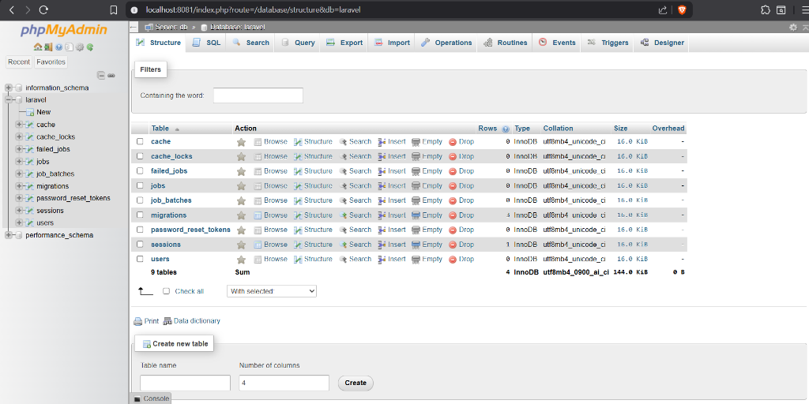

# Laravel Docker Environment Setup Guide

This guide provides instructions for setting up and running the Laravel application using the provided Docker configuration.

## 1. Prerequisites
- **Docker Desktop**: Ensure Docker Desktop is installed and running.
- **Git** (Optional): For version control.

## 2. Usage Directions

### Scenario A: Starting Fresh (New Project)
If you are creating this project from scratch using the provided Docker files:

1.  **Start the Containers**:
    ```bash
    docker-compose up -d
    ```
    
    
3.  **Install Laravel**:
    Run the installer *inside* the container to populate the `src` folder:
    ```bash
    docker-compose exec app composer create-project --prefer-dist laravel/laravel .
    ```
    
    
5.  **Set Database Config**:
    Edit `src/.env` to use the container's database service:
    ```env
    DB_CONNECTION=mysql
    DB_HOST=db
    DB_PORT=3306
    DB_DATABASE=laravel
    DB_USERNAME=laravel
    DB_PASSWORD=secret
    ```
    
6.  **Run Migrations**:
    ```bash
    docker-compose exec app php artisan migrate
    ```

### Scenario B: Existing Project (Cloned Repository)
If you pulled this code from a repository or moved it to a new machine:

1.  **Start the Containers**:
    ```bash
    docker-compose up -d
    ```
    
2.  **Install Dependencies**:
    ```bash
    docker-compose exec app composer install
    ```
    
3.  **Environment Setup**:
    ```bash
    # Copy env example
    docker-compose exec app cp .env.example .env
    
    # Generate Key
    docker-compose exec app php artisan key:generate
    
    # Configure Database (edit .env as shown in Scenario A)
    ```
    
4.  **Migrate**:
    ```bash
    docker-compose exec app php artisan migrate
    ```

## 3. Accessing the Application
- **Web App**: [http://localhost:8080](http://localhost:8080)
    
  
- **Database (phpMyAdmin)**: [http://localhost:8081](http://localhost:8081)
    
    - **User**: `laravel`
    - **Pass**: `secret`

## 4. Common Commands Reference
Run these from the root directory (where `docker-compose.yml` is):

| Action | Command |
| :--- | :--- |
| **Stop Containers** | `docker-compose down` |
| **Restart Containers** | `docker-compose restart` |
| **Run Artisan Command** | `docker-compose exec app php artisan [command]` |
| **Run Composer** | `docker-compose exec app composer [command]` |
| **View Logs** | `docker-compose logs -f` |

## 5. Troubleshooting
- **Port Conflicts**: If port `8080` is in use, edit `docker-compose.yml` and change `"8080:80"` to `"8082:80"`.
- **Database Connection**: Ensure `DB_HOST=db` in `.env`. Do NOT use `localhost` or `127.0.0.1` inside the `.env` file, as the container sees `localhost` as itself, not the database container.
- **Permission Denied**: If you see `file_put_contents(...) Permission denied` errors:
  
    ```bash
    docker-compose exec app chmod -R 777 storage bootstrap/cache
    ```
    
- **App Key Missing**: If you see `No application encryption key has been specified`:
  
    ```bash
    docker-compose exec app php artisan key:generate
    docker-compose exec app php artisan config:cache
    ```
